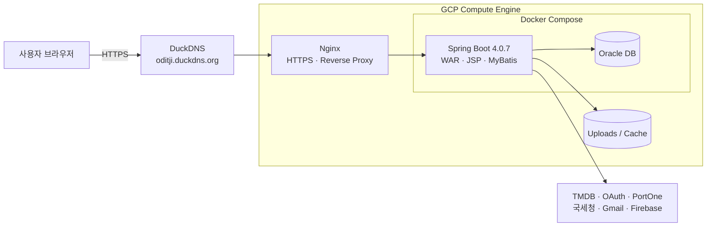
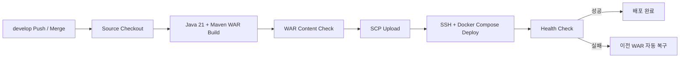

# ODITJI

[](https://github.com/dy8327/oditji/actions/workflows/deploy.yml)

OTT 콘텐츠 검색과 관련 상품 구매를 하나의 흐름으로 연결한 **콘텐츠 커머스 통합 플랫폼**입니다.  
사용자는 여러 OTT 콘텐츠를 검색하고 상세 정보·랭킹·리뷰를 확인할 수 있으며, 콘텐츠와 연결된 상품을 장바구니에 담아 주문·결제할 수 있습니다.  
사업자는 상품·이벤트·주문·배송·정산을 관리하고, 관리자는 서비스 전반의 승인과 운영 업무를 처리합니다.

---

## 서비스 접속

- **운영 URL:** https://oditji.duckdns.org/oditji
- **기본 브랜치:** `develop`
- **배포 환경:** GCP Compute Engine + Docker Compose + Nginx
- **보안 연결:** HTTPS 적용 및 HTTP → HTTPS 리다이렉트

> 운영 계정과 외부 API 비밀키는 저장소에 포함하지 않습니다.

---

## 프로젝트 개요

| 구분 | 내용 |
| --- | --- |
| 프로젝트명 | ODITJI |
| 개발 기간 | 2026.06 ~ 2026.08 |
| 개발 인원 | 4명 |
| 프로젝트 형태 | 학원 최종 팀 프로젝트 |
| 핵심 주제 | OTT 통합 검색 + 콘텐츠 연계 상품 커머스 |
| 주요 사용자 | 일반 사용자, 사업자, 관리자 |
| 애플리케이션 경로 | `/oditji` |

### 핵심 목표

1. 여러 OTT 콘텐츠를 한곳에서 검색하고 상세 정보를 제공한다.
2. 콘텐츠·배우와 연결된 상품을 탐색하고 주문·결제할 수 있게 한다.
3. 사용자·사업자·관리자의 역할별 화면과 권한을 분리한다.
4. 사업자 승인, 상품·이벤트 승인, 주문·배송, 정산까지 운영 흐름을 구현한다.
5. GitHub Actions와 GCP 기반의 자동 배포 환경을 구성한다.

---

## 주요 기능

### 일반 사용자

- 일반 회원가입, 로그인, 로그아웃
- Kakao·Naver·Google 소셜 로그인
- 비밀번호 암호화 및 계정 상태에 따른 접근 제어
- 프로필 조회·수정·이미지 변경·회원 탈퇴
- 성인인증
- OTT 콘텐츠 통합 검색, 자동완성, 필터, 페이징
- 콘텐츠 상세 정보, 출연진, 플랫폼 정보, 랭킹 조회
- 찜 목록과 개인 콘텐츠 목록 관리
- 리뷰 작성·수정·삭제 및 평점 확인
- 콘텐츠·배우 연계 상품 조회
- 장바구니, 주문, 결제, 주문 취소, 구매 내역 조회
- 사업자와의 채팅 및 알림 확인

### 사업자

- 일반 회원의 사업자 전환 신청
- 국세청 API를 이용한 사업자등록번호 진위 확인
- 사업자등록증 업로드 및 관리자 승인 대기
- 사업자 대시보드와 매출·주문 통계 조회
- 콘텐츠·배우 연계 상품 등록·수정·삭제 요청
- 대표 이미지와 상세 이미지 업로드
- 의류·신발 등 상품 옵션과 재고 관리
- 이벤트 등록·수정·연장 요청
- 주문 확인, 배송 상태 변경, 구매 내역 관리
- 매출 내역, 정산 예정 금액, 정산 완료 내역 조회
- 정산 계좌 관리
- 사용자와의 채팅 및 운영 알림 확인

### 관리자

- 회원 조회, 상태 변경, 블랙리스트 및 탈퇴 관리
- 사업자 신청 조회, 승인·반려
- 상품 등록·수정·삭제 요청 승인·반려
- 이벤트 등록·수정 요청 승인·반려
- 콘텐츠·리뷰·주문 운영 관리
- 사업자 등급과 수수료율 관리
- 정산 대상 조회 및 정산 처리
- 서비스 통계와 승인 요청 현황 확인
- 사용자·사업자 대상 알림 관리

---

## 시스템 아키텍처



### 요청 흐름

```text
사용자 브라우저
    → DuckDNS 도메인
    → Nginx HTTPS / Reverse Proxy
    → Spring Boot 애플리케이션
    → MyBatis
    → Oracle DB
```

---

## 기술 스택

### Backend

| 기술 | 용도 |
| --- | --- |
| Java 21 | 애플리케이션 개발 언어 |
| Spring Boot 4.0.7 | 애플리케이션 프레임워크 |
| Spring MVC | Controller·Service 기반 웹 요청 처리 |
| Spring Security / OAuth2 Client | 인증, 권한, 소셜 로그인 |
| MyBatis 4.0.1 | SQL Mapper 기반 데이터 접근 |
| Oracle DB / OJDBC11 | 운영 데이터 저장 |
| Spring Mail | 이메일 발송 |
| Caffeine Cache | 검색 데이터 캐시 |
| Thumbnailator | 업로드 이미지 처리 |

### Frontend

| 기술 | 용도 |
| --- | --- |
| JSP / JSTL | 서버 사이드 화면 렌더링 |
| HTML5 / CSS3 | 화면 구조와 스타일 |
| JavaScript | 비동기 요청과 사용자 인터랙션 |
| Firebase Firestore | 실시간 채팅 데이터 처리 |

### Test / Quality

| 기술 | 용도 |
| --- | --- |
| JUnit 5 | 단위·통합 테스트 |
| Mockito | Service·Controller 의존성 Mock 테스트 |
| JaCoCo | 테스트 커버리지 측정 |
| SonarQube | 정적 분석과 품질 점검 |

### Build / Infra

| 기술 | 용도 |
| --- | --- |
| Maven | 의존성 관리와 WAR 빌드 |
| GitHub Actions | CI/CD 자동화 |
| GCP Compute Engine | 운영 서버 |
| Docker Compose | 애플리케이션·DB·Nginx 컨테이너 관리 |
| Nginx | HTTPS 종료와 Reverse Proxy |
| DuckDNS | 운영 도메인 연결 |
| GitHub / Notion / VS Code | 형상 관리와 협업 |

---

## 외부 서비스 연동

| 서비스 | 사용 목적 |
| --- | --- |
| TMDB API | 콘텐츠·출연진·포스터·상세 정보 조회 |
| Kakao OAuth | Kakao 소셜 로그인 |
| Naver OAuth | Naver 소셜 로그인 |
| Google OAuth | Google 소셜 로그인 |
| PortOne | 결제 및 본인·성인인증 연동 |
| 국세청 사업자등록정보 API | 사업자등록번호 진위 확인 |
| Gmail SMTP | 인증·안내 이메일 발송 |
| Firebase Firestore | 실시간 채팅 |

---

## 프로젝트 구조

```text
oditji
├── .github/workflows
│   └── deploy.yml
├── src/main/java/com/project/oditji
│   ├── common
│   ├── member
│   ├── business
│   ├── admin
│   ├── content
│   ├── search
│   ├── tmdb
│   ├── goods
│   ├── cart
│   ├── order
│   ├── payment
│   ├── review
│   ├── favorite
│   ├── recommend
│   ├── event
│   ├── chat
│   ├── notification
│   └── mail
├── src/main/resources
│   ├── application-prod.properties
│   ├── mybatis
│   │   └── mappers
│   └── static
├── src/main/webapp/WEB-INF/views
├── src/test/java
├── pom.xml
└── README.md
```

### 계층 구조

```text
Controller
    ↓
Service / ServiceImpl
    ↓
DAO
    ↓
MyBatis Mapper XML
    ↓
Oracle DB
```

---

## 로컬 실행 방법

### 1. 필요 환경

- JDK 21
- Oracle Database
- Git
- Maven 또는 Maven Wrapper

### 2. 저장소 내려받기

```bash
git clone https://github.com/dy8327/oditji.git
cd oditji
git checkout develop
```

### 3. 로컬 설정 파일 작성

`src/main/resources/application.properties`는 Git에 포함되지 않습니다.  
로컬 DB와 외부 API 설정에 맞게 직접 작성해야 합니다.

```properties
server.port=8080
server.servlet.context-path=/oditji

spring.datasource.driver-class-name=oracle.jdbc.OracleDriver
spring.datasource.url=jdbc:oracle:thin:@localhost:1521/XEPDB1
spring.datasource.username=YOUR_DB_USERNAME
spring.datasource.password=YOUR_DB_PASSWORD

spring.mvc.view.prefix=/WEB-INF/views/
spring.mvc.view.suffix=.jsp
```

외부 API와 OAuth 기능을 사용할 경우 각 서비스의 Client ID, Client Secret, Token 설정도 추가해야 합니다.  
실제 비밀값은 커밋하지 않습니다.

### 4. 테스트

Windows:

```bat
mvnw.cmd clean test
```

macOS / Linux:

```bash
./mvnw clean test
```

### 5. WAR 빌드

Windows:

```bat
mvnw.cmd clean package
```

macOS / Linux:

```bash
./mvnw clean package
```

빌드 결과는 `target/` 디렉터리에 WAR 파일로 생성됩니다.

### 6. 실행

```bash
java -jar target/oditji-0.0.1-SNAPSHOT.war
```

접속 주소:

```text
http://localhost:8080/oditji
```

---

## 운영 환경 설정

운영 설정은 `application-prod.properties`에서 환경변수로 주입합니다.

| 분류 | 주요 환경변수 |
| --- | --- |
| Database | `SPRING_DATASOURCE_URL`, `SPRING_DATASOURCE_USERNAME`, `SPRING_DATASOURCE_PASSWORD` |
| Service URL | `APP_BASE_URL` |
| Kakao | `KAKAO_CLIENT_ID`, `KAKAO_CLIENT_SECRET` |
| Naver | `NAVER_CLIENT_ID`, `NAVER_CLIENT_SECRET` |
| Google | `GOOGLE_CLIENT_ID`, `GOOGLE_CLIENT_SECRET` |
| TMDB | `TMDB_API_TOKEN` |
| PortOne | `PORTONE_STORE_ID`, `PORTONE_API_SECRET`, Channel Key 항목 |
| 국세청 | `NTS_BUSINESS_SERVICE_KEY` |
| Mail | `MAIL_USERNAME`, `MAIL_PASSWORD` |

운영 서버의 업로드 파일과 검색 캐시는 `/opt/oditji/uploads`, `/opt/oditji/cache` 경로를 사용합니다.

---

## CI/CD 파이프라인

`develop` 브랜치에 변경사항이 반영되면 GitHub Actions의 `Deploy ODITJI` 워크플로가 실행됩니다.



### 배포 처리 내용

1. Java 21 환경에서 Maven WAR 빌드
2. 핵심 JSP와 Controller 클래스가 WAR에 포함됐는지 확인
3. SSH/SCP로 GCP 서버에 WAR 업로드
4. Docker Compose로 애플리케이션 컨테이너 재생성
5. Nginx 재시작 후 애플리케이션 상태 확인
6. 실패 로그 출력 및 이전 WAR 자동 복구
7. 동일 운영 환경에 대한 동시 배포 방지

---

## 오류 처리와 보안

- 403·404·500 사용자 안내 화면 제공
- API 요청은 JSON 형식으로 오류 응답
- 운영 환경에서 예외 메시지와 Stack Trace 노출 차단
- 비밀번호 BCrypt 암호화
- 사용자·사업자·관리자 권한별 접근 제어
- CSRF 보호 적용
- DB·OAuth·결제·메일 비밀값 환경변수 분리
- `.env`, 인증서, 개인키, 서비스 계정 파일 Git 추적 제외
- 업로드 파일과 검색 캐시 저장소 추적 제외

---

## 브랜치 전략

```text
main
└── develop
    ├── feature/doyoung
    ├── feature/daseol
    ├── feature/taeshin
    └── feature/choiminkwan0
```

| 브랜치 | 용도 |
| --- | --- |
| `main` | 최종 제출·발표용 안정 버전 |
| `develop` | 기능 통합 및 운영 자동 배포 기준 |
| `feature/*` | 팀원별 기능 개발 |

### 협업 규칙

1. 기능 작업은 각자의 `feature/*` 브랜치에서 진행합니다.
2. 작업 완료 후 `develop` 대상으로 Pull Request를 생성합니다.
3. 병합 전 로컬 빌드와 주요 기능을 확인합니다.
4. 공통 설정, Mapper, 공통 CSS 수정은 팀에 공유합니다.
5. `main`은 최종 안정 버전 반영 시 사용합니다.

---

## 프로젝트 진행 상태

- GCP 운영 배포 완료
- Docker 기반 애플리케이션·Oracle DB·Nginx 구성 완료
- DuckDNS 도메인과 HTTPS 적용 완료
- GitHub Actions 자동 배포 완료
- 배포 실패 시 상태 확인과 이전 WAR 복구 적용
- 사용자 → 사업자 → 관리자 흐름의 주요 기능 통합 완료

---

## 참고 사항

- 본 프로젝트는 교육 과정의 최종 팀 프로젝트로 제작되었습니다.
- 운영 계정, DB 비밀번호, OAuth Secret, API Token 등 민감정보는 저장소에 포함하지 않습니다.
- 외부 API 정책이나 운영 환경에 따라 일부 기능은 별도 설정이 필요합니다.
